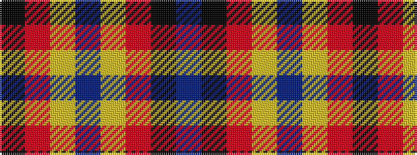

BKRYBYRK

It is a 8 stripe tartan.

<figure class="pat-woven">

<figcaption>idealised sample</figcaption>
</figure>

## Colour Sequence



## Tartans with this colour sequence

| Tartans |
|---------------|
| [Ikelman #3 (Personal)](/setts/s8/n11k4r4lo4n11~x4/)|
||
