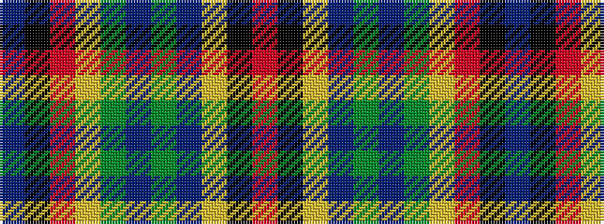

BKRYGBGBYKR

It is a 11 stripe tartan.

<figure class="pat-woven">

<figcaption>idealised sample</figcaption>
</figure>

## Colour Sequence



## Tartans with this colour sequence

| Tartans |
|---------------|
| [Berwick Friendship](/variants/s11/db24k6r6ly12dg6db6dg6db12ly1k1r2~x2/)|
||
| [Berwick Friendship (Corporate)](/variants/s11/b24k6r6ly12g6b6g6b12ly1k1r2~x2/)|
||
