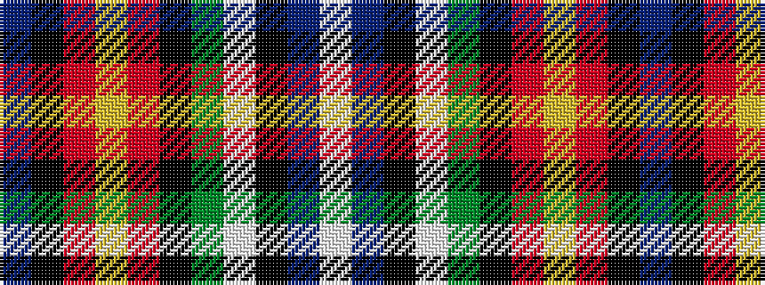

BKRYRKGWKBW

It is a 11 stripe tartan.

<figure class="pat-woven">

<figcaption>idealised sample</figcaption>
</figure>

## Colour Sequence



## Tartans with this colour sequence

| Tartans |
|---------------|
| [Unnamed C20th - National Archives](/setts/s11/t8k1r22ly1r6k3dg10w1k3t20w1~x2/)|
||
