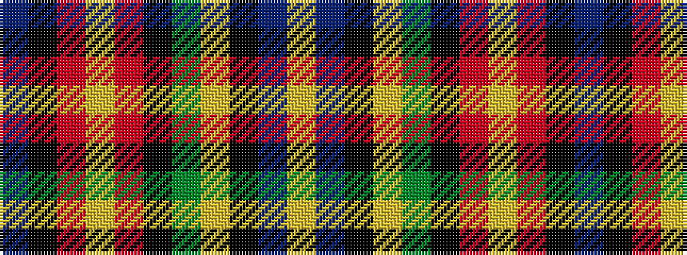

BKRYRKGYKBY

It is a 11 stripe tartan.

<figure class="pat-woven">

<figcaption>idealised sample</figcaption>
</figure>

## Colour Sequence



## Tartans with this colour sequence

| Tartans |
|---------------|
| [Faulkner (Personal)](/variants/s11/n8k2o26lo1o6k3dg10lg1k3n22lg1~x2/)|
||
