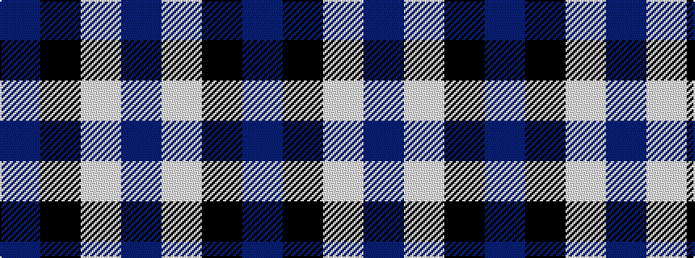

BKWB

It is a 4 stripe tartan.

<figure class="pat-woven">

<figcaption>idealised sample</figcaption>
</figure>

## Colour Sequence



## Tartans with this colour sequence

| Tartans |
|---------------|
| [Thunderlord (Celtic Group, USA)](/variants/s4/dt62w11k4t17~x2/)|
||
