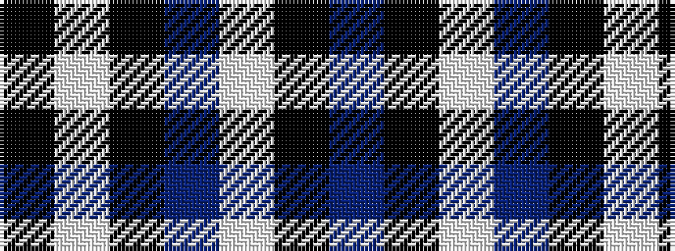

BKWBKWK

It is a 7 stripe tartan.

<figure class="pat-woven">

<figcaption>idealised sample</figcaption>
</figure>

## Colour Sequence



## Tartans with this colour sequence

| Tartans |
|---------------|
| [Dalziel Rugby Club (Corporate)](/setts/s7/db56k4w1db6k20w2k20~x2/)|
||
