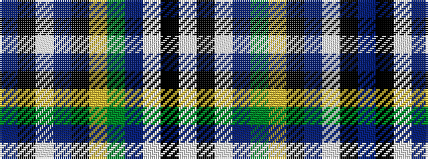

BKWBKYGBWKW

It is a 11 stripe tartan.

<figure class="pat-woven">

<figcaption>idealised sample</figcaption>
</figure>

## Colour Sequence



## Tartans with this colour sequence

| Tartans |
|---------------|
| [Veere](/setts/s11/lb7k11lt3db9g19lo3k22db9lt3k3db6~x2/)|
||
