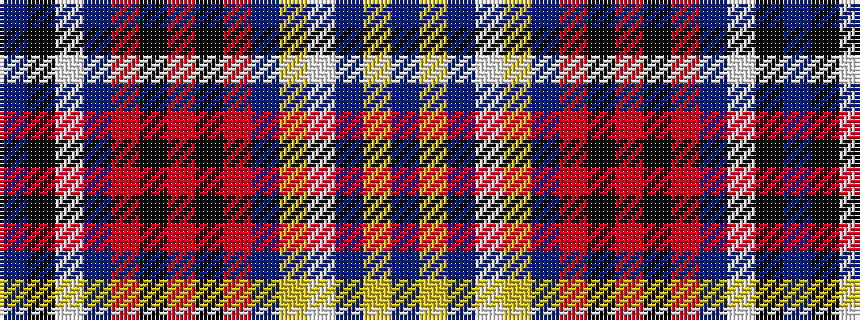

BKWBRKRKRBYWBYB

It is a 15 stripe tartan.

<figure class="pat-woven">

<figcaption>idealised sample</figcaption>
</figure>

## Colour Sequence



## Tartans with this colour sequence

| Tartans |
|---------------|
| [Proven](/variants/s15/dt14lo3dt14lb10lo2dt7m5k2m2k2m5dt9w1k2dt2~x2/)|
||
