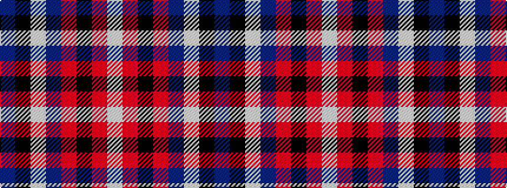

BKWBRKRW

It is a 8 stripe tartan.

<figure class="pat-woven">

<figcaption>idealised sample</figcaption>
</figure>

## Colour Sequence



## Tartans with this colour sequence

| Tartans |
|---------------|
| [President High School](/variants/s8/n83k7w6n10r7k3r20w3~x2/)|
||
