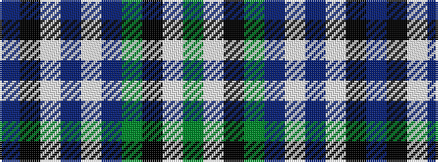

BKWBWBGKWG

It is a 10 stripe tartan.

<figure class="pat-woven">

<figcaption>idealised sample</figcaption>
</figure>

## Colour Sequence



## Tartans with this colour sequence

| Tartans |
|---------------|
| [Head of the Lakes](/setts/s10/g6w1k12g6p2w1p2w1k12t1~x2/)|
||
