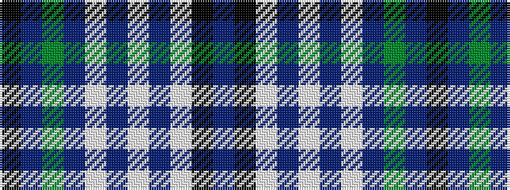

BKWBWBWBGBK

It is a 11 stripe tartan.

<figure class="pat-woven">

<figcaption>idealised sample</figcaption>
</figure>

## Colour Sequence



## Tartans with this colour sequence

| Tartans |
|---------------|
| [Lorne Dress (Dance) Fashion Tartan Tartan Number: 6560. Earliest known date: 01/01/2005 A dance tartan from DC Dalgliesh of Selkirk. See products available Copyright © Blair Urquhart, Comrie, 2015](/setts/s11/k3db1g19db19w2db2w2db2w27k1db3~x2/)|
||
