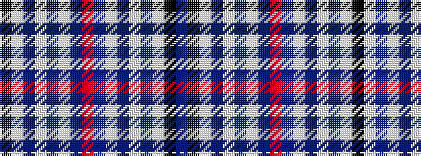

BKWBWBWBRBWBWBWK

It is a 16 stripe tartan.

<figure class="pat-woven">

<figcaption>idealised sample</figcaption>
</figure>

## Colour Sequence



## Tartans with this colour sequence

| Tartans |
|---------------|
| [Orlando Dress, City of](/setts/s16/b12k1w16b1w1b14w3b14r2~x4/)|
||
