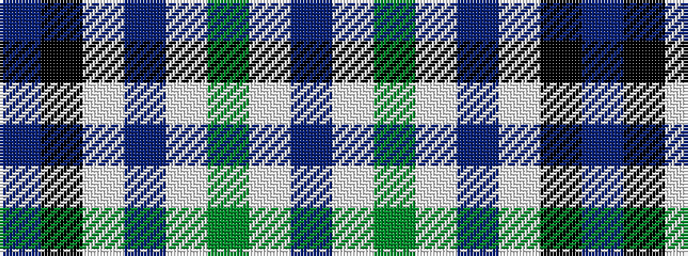

BKWBWGWB

It is a 8 stripe tartan.

<figure class="pat-woven">

<figcaption>idealised sample</figcaption>
</figure>

## Colour Sequence



## Tartans with this colour sequence

| Tartans |
|---------------|
| [Shaw, Miss Rebecca (Personal)](/variants/s8/t5k1w30dp15w8g30w8dp2~x2/)|
||
