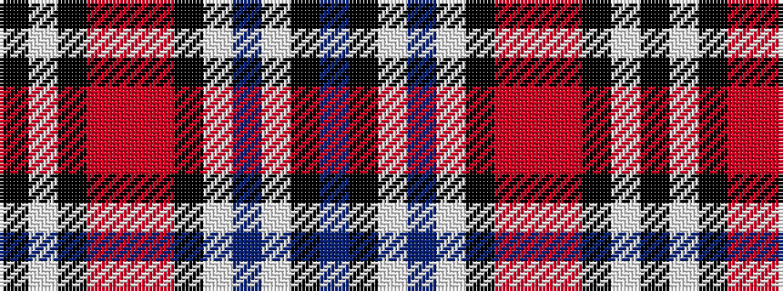

BKWBWKRRRKWK

It is a 12 stripe tartan.

<figure class="pat-woven">

<figcaption>idealised sample</figcaption>
</figure>

## Colour Sequence



## Tartans with this colour sequence

| Tartans |
|---------------|
| [Quebec Centennial #2](/setts/s12/db16k4lb4db8lb24k2r3r20r4k12lb6k1~x2/)|
||
