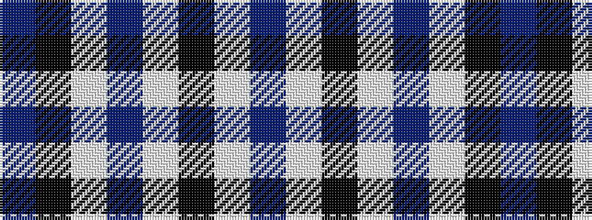

BKWBWKWB

It is a 8 stripe tartan.

<figure class="pat-woven">

<figcaption>idealised sample</figcaption>
</figure>

## Colour Sequence



## Tartans with this colour sequence

| Tartans |
|---------------|
| [Lynn (Personal)](/variants/s8/b18w1k3w1b9w1k45b4~x2/)|
||
