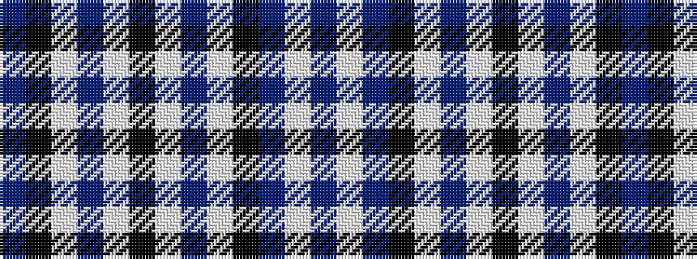

BKWBWKWBWKBWB

It is a 13 stripe tartan.

<figure class="pat-woven">

<figcaption>idealised sample</figcaption>
</figure>

## Colour Sequence



## Tartans with this colour sequence

| Tartans |
|---------------|
| [Scottish Bluebell (Corporate)](/variants/s13/db80k34w4b8w4k8w4b8w4k34db80w1b8~x2/)|
||
