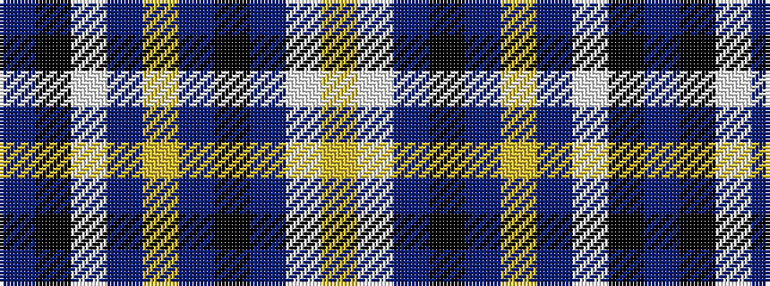

BKWBYBKBWY

It is a 10 stripe tartan.

<figure class="pat-woven">

<figcaption>idealised sample</figcaption>
</figure>

## Colour Sequence



## Tartans with this colour sequence

| Tartans |
|---------------|
| [Regan](/variants/s10/dp1k1w1dp10ly1db2k1db2w1ly1~x8/)|
||
