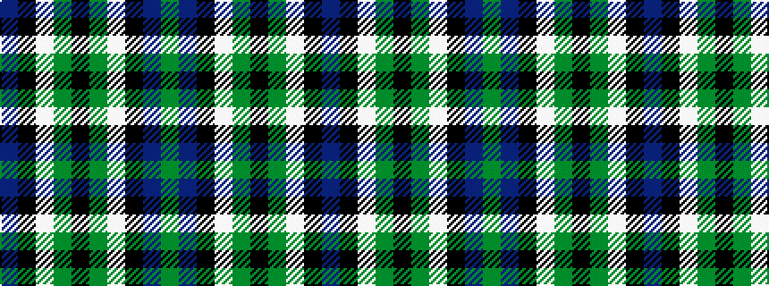

BKWGKGWKBG

It is a 10 stripe tartan.

<figure class="pat-woven">

<figcaption>idealised sample</figcaption>
</figure>

## Colour Sequence



## Tartans with this colour sequence

| Tartans |
|---------------|
| [Wilson's No.076](/variants/s10/dp17k18w2g17k3g17w2k18dp17g3~x2/)|
||
