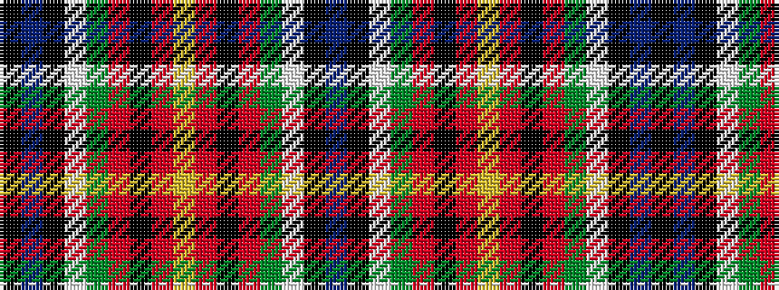

BKWGRKRYRKRGWKBK

It is a 16 stripe tartan.

<figure class="pat-woven">

<figcaption>idealised sample</figcaption>
</figure>

## Colour Sequence



## Tartans with this colour sequence

| Tartans |
|---------------|
| [Royal Canadian Mounted Police Corporate Tartan](/variants/s16/k76b1k2lb1g14r5k13o1lo1~x2/)|
||
