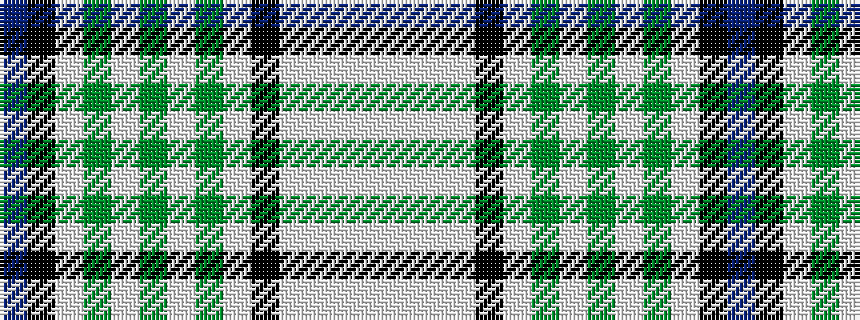

BKWGWGWGWKWWWW

It is a 14 stripe tartan.

<figure class="pat-woven">

<figcaption>idealised sample</figcaption>
</figure>

## Colour Sequence



## Tartans with this colour sequence

| Tartans |
|---------------|
| [Wiseman Dairies Corporate Tartan Tartan Number: 2393. Earliest known date: 1997 The colours and the sett are inspired by the well known black and white graphic designs of Wiseman's milk and cream packets, a moving landmark of the early morning City of Edinburgh. See products available Copyright © Blair Urquhart, Comrie, 2015](/setts/s14/lb7w3lb2w30k5w3g2w3g8w3g2w3k30dp2~x2/)|
||
