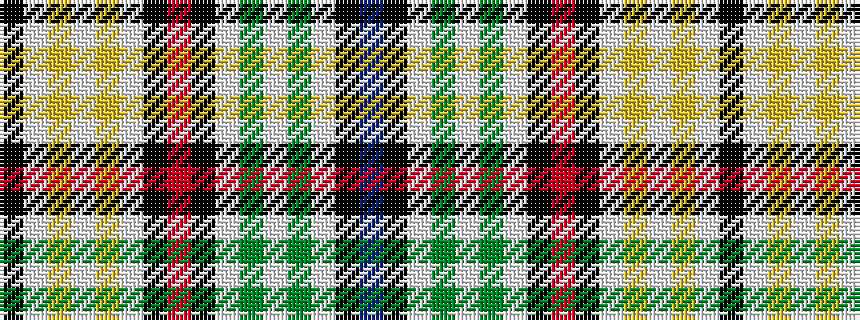

BKWGWGWKRKWYWYWK

It is a 16 stripe tartan.

<figure class="pat-woven">

<figcaption>idealised sample</figcaption>
</figure>

## Colour Sequence



## Tartans with this colour sequence

| Tartans |
|---------------|
| [Kinnieson (Personal)](/setts/s16/k64lb38lo4lb38lo4lb38k64r8k64lb38g4lb38g4lb38k65db8/)|
||
