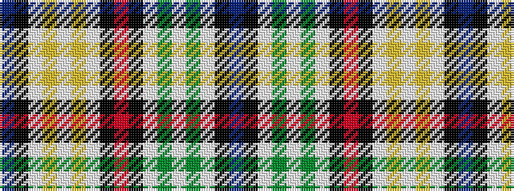

BKWGWGWKRKWYWYWKB

It is a 17 stripe tartan.

<figure class="pat-woven">

<figcaption>idealised sample</figcaption>
</figure>

## Colour Sequence



## Tartans with this colour sequence

| Tartans |
|---------------|
| [Kinnison](/variants/s17/db8k65w38g4w38g4w38k65r8k65w38ly4w38ly4w38k65db8/)|
||
