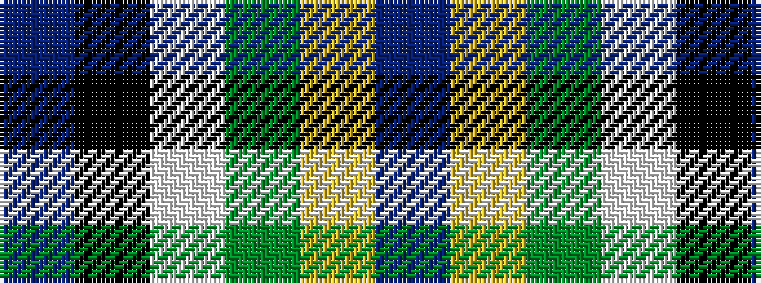

BKWGYB

It is a 6 stripe tartan.

<figure class="pat-woven">

<figcaption>idealised sample</figcaption>
</figure>

## Colour Sequence



## Tartans with this colour sequence

| Tartans |
|---------------|
| [Woodward, R Glenn](/setts/s6/db25k84w5g32ly5dp8~x2/)|
||
| [Woodward, R Glenn (Personal)](/setts/s6/dt25k84w5dg23lo5dp8~x2/)|
||
