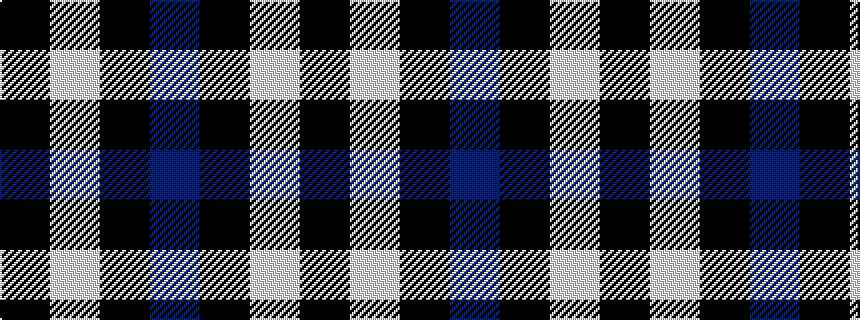

BKWK

It is a 4 stripe tartan.

<figure class="pat-woven">

<figcaption>idealised sample</figcaption>
</figure>

## Colour Sequence



## Tartans with this colour sequence

| Tartans |
|---------------|
| [Dunnotar (School)](/variants/s4/k72w3k11db9/)|
||
| [Pride of New Zealand](/variants/s4/n62k30w1k1~x2/)|
||
| [Pride of New Zealand, The](/variants/s4/n124k60w1k2~x2/)|
||
