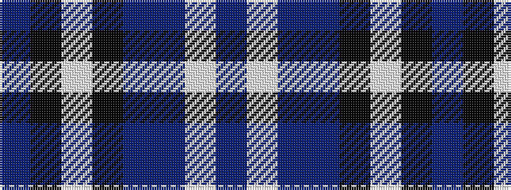

BKWKBBWB

It is a 8 stripe tartan.

<figure class="pat-woven">

<figcaption>idealised sample</figcaption>
</figure>

## Colour Sequence



## Tartans with this colour sequence

| Tartans |
|---------------|
| [Longniddry, dress (Turquoise)](/setts/s8/t42k2w2k2t5n12w32t4~x2/)|
||
