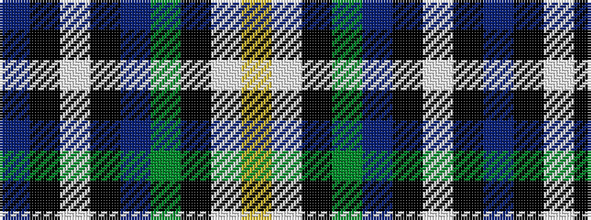

BKWKBGKWY

It is a 9 stripe tartan.

<figure class="pat-woven">

<figcaption>idealised sample</figcaption>
</figure>

## Colour Sequence



## Tartans with this colour sequence

| Tartans |
|---------------|
| [Minnesota Dress](/variants/s9/dp4k2w3k2db30g9k4w20ly3~x2/)|
||
