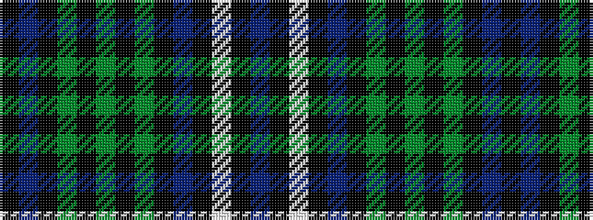

BKWKBKGKGKGKBK

It is a 14 stripe tartan.

<figure class="pat-woven">

<figcaption>idealised sample</figcaption>
</figure>

## Colour Sequence



## Tartans with this colour sequence

| Tartans |
|---------------|
| [Caithelyn (Personal)](/setts/s14/dp20k2w2k2dp2k10g3k2g20k2g3k10dp8k2~x2/)|
||
