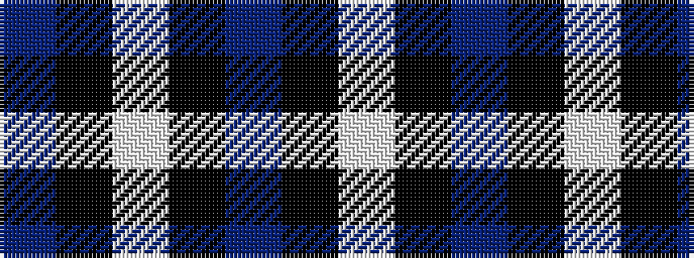

BKWKBKW

It is a 7 stripe tartan.

<figure class="pat-woven">

<figcaption>idealised sample</figcaption>
</figure>

## Colour Sequence



## Tartans with this colour sequence

| Tartans |
|---------------|
| [Believe - Colette](/variants/s7/n3k31w6k7n3k12w2~x2/)|
||
| [Believe - Colette](/variants/s7/n3k31w6k8n3k12w2~x2/)|
||
