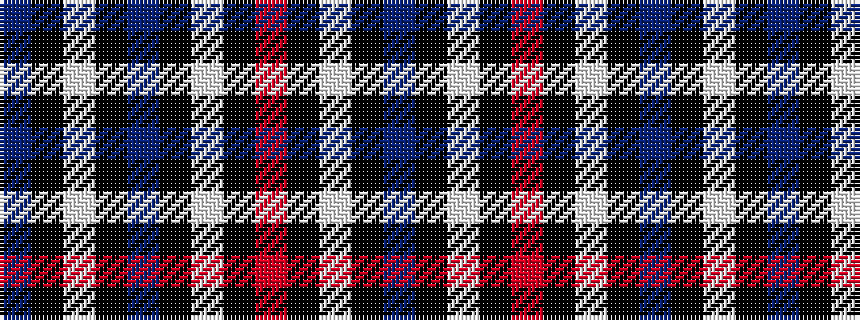

BKWKBKWKRKWKB

It is a 13 stripe tartan.

<figure class="pat-woven">

<figcaption>idealised sample</figcaption>
</figure>

## Colour Sequence



## Tartans with this colour sequence

| Tartans |
|---------------|
| [Kieck (2015)](/setts/s13/t6k2w3k2t6k4lb9k2r2k46lb2k2t6~x2/)|
||
