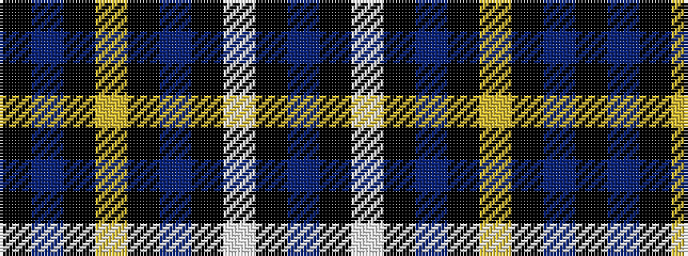

BKWKBKYKBK

It is a 10 stripe tartan.

<figure class="pat-woven">

<figcaption>idealised sample</figcaption>
</figure>

## Colour Sequence



## Tartans with this colour sequence

| Tartans |
|---------------|
| [Canberra, City of District Tartan Tartan Number: 4449. Earliest known date: pre 2002 Count from a Stathmore Woollen sample. Designed by Peter Burrows and Stewart Smith with tech support from Strathmore. For the exclusive use by Messrs Scottish Flair, Queanbeyan, Australia. Colours represented; DB for the Canberra flag. Gold (yellow) and white for the stars on the Canberra flag. mb for the Canberra Bluebell. See products available Copyright © Blair Urquhart, Comrie, 2015](/setts/s10/k76db22k1lo3k1db3k1w2k1db10~x2/)|
||
