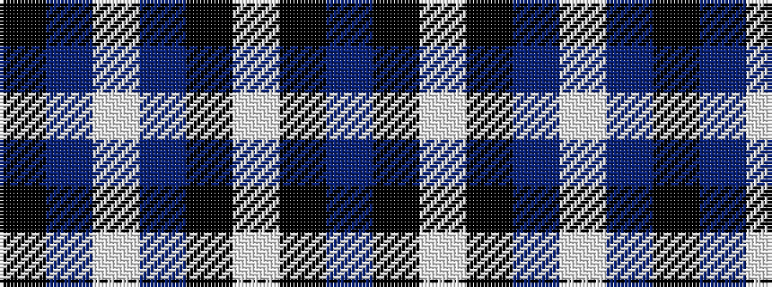

BKWKBWBK

It is a 8 stripe tartan.

<figure class="pat-woven">

<figcaption>idealised sample</figcaption>
</figure>

## Colour Sequence



## Tartans with this colour sequence

| Tartans |
|---------------|
| [Conquergood](/setts/s8/k2b2w11b5k5w2k1b2~x2/)|
||
