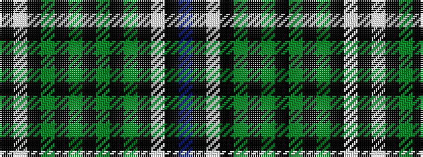

BKWKGKGKGKGKWK

It is a 14 stripe tartan.

<figure class="pat-woven">

<figcaption>idealised sample</figcaption>
</figure>

## Colour Sequence



## Tartans with this colour sequence

| Tartans |
|---------------|
| [Hartmann (Personal)](/variants/s14/k8w3k8g4k4g32k4g32k4g4k8w3k8t4~x2/)|
||
