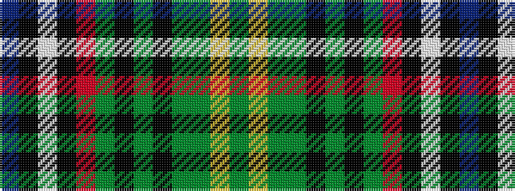

BKWKRGKGKGGYG

It is a 13 stripe tartan.

<figure class="pat-woven">

<figcaption>idealised sample</figcaption>
</figure>

## Colour Sequence



## Tartans with this colour sequence

| Tartans |
|---------------|
| [Wild Geese](/variants/s13/db8k1w5k1r5dg13k2g4k2g11dg20lo7dg5~x2/)|
||
