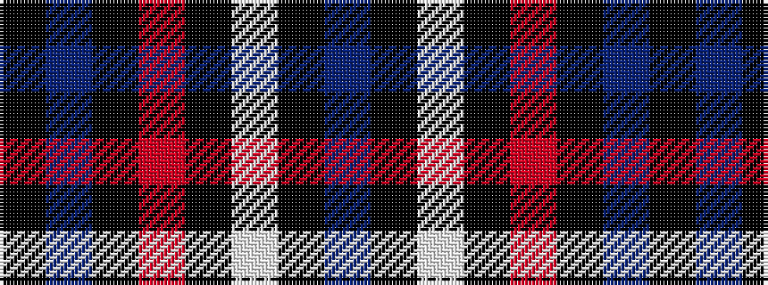

BKWKRKBK

It is a 8 stripe tartan.

<figure class="pat-woven">

<figcaption>idealised sample</figcaption>
</figure>

## Colour Sequence



## Tartans with this colour sequence

| Tartans |
|---------------|
| [Millarkie, Will (Personal)](/setts/s8/k15db10k15r7k15w5k15db10/)|
||
