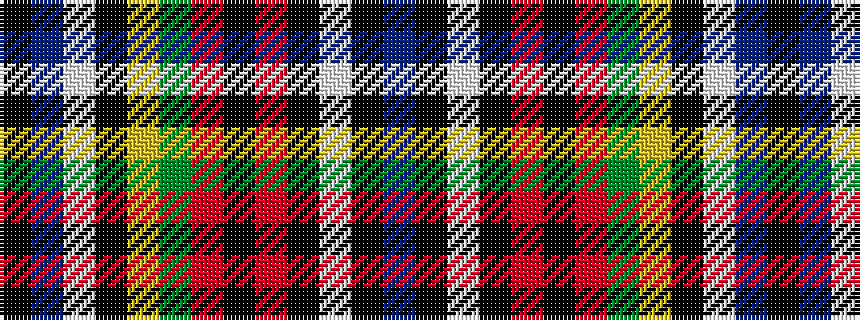

BKWKRKRGYKWBK

It is a 13 stripe tartan.

<figure class="pat-woven">

<figcaption>idealised sample</figcaption>
</figure>

## Colour Sequence



## Tartans with this colour sequence

| Tartans |
|---------------|
| [New World Celts (Corporate)](/variants/s13/k75t2w2k2ly2dg4r3k2r4k1w4k2t5~x2/)|
||
