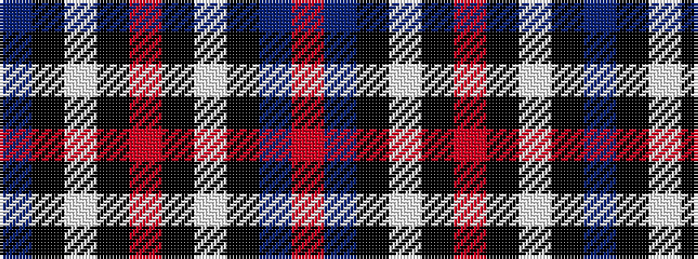

BKWKRKWKBR

It is a 10 stripe tartan.

<figure class="pat-woven">

<figcaption>idealised sample</figcaption>
</figure>

## Colour Sequence



## Tartans with this colour sequence

| Tartans |
|---------------|
| [Hydro-Electric](/setts/s10/db11k4w5k1r3k1w5k4db11r1~x4/)|
||
