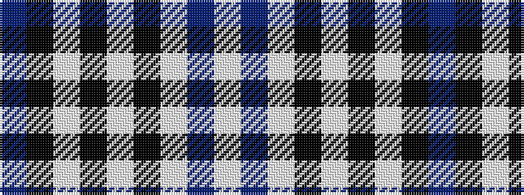

BKWKWKWBW

It is a 9 stripe tartan.

<figure class="pat-woven">

<figcaption>idealised sample</figcaption>
</figure>

## Colour Sequence



## Tartans with this colour sequence

| Tartans |
|---------------|
| [Christopher Newport University](/setts/s9/db5k1lb2k1w6k1lb2db25lb2~x2/)|
||
