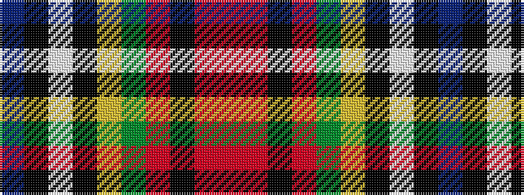

BKWKYGRKRR

It is a 10 stripe tartan.

<figure class="pat-woven">

<figcaption>idealised sample</figcaption>
</figure>

## Colour Sequence



## Tartans with this colour sequence

| Tartans |
|---------------|
| [Campbell, hunting](/setts/s10/db4k1w2k3ly1y12o1k12o12r4~x2/)|
||
