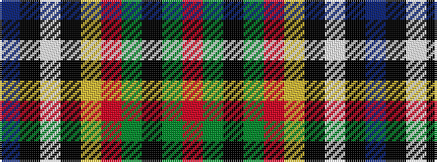

BKWKYRGKGR

It is a 10 stripe tartan.

<figure class="pat-woven">

<figcaption>idealised sample</figcaption>
</figure>

## Colour Sequence



## Tartans with this colour sequence

| Tartans |
|---------------|
| [Campbell Hunting](/variants/s10/r4dy12k12dy1o12ly1k3w2k1b4~x2/)|
||
