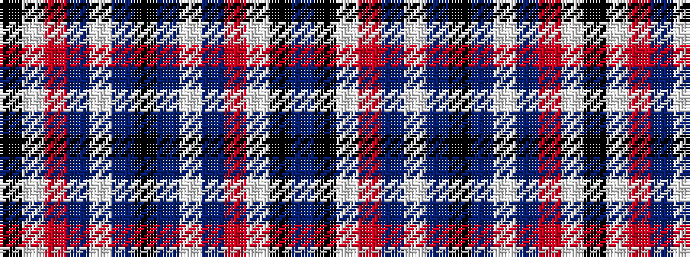

BKWRBWBKBWBRWK

It is a 14 stripe tartan.

<figure class="pat-woven">

<figcaption>idealised sample</figcaption>
</figure>

## Colour Sequence



## Tartans with this colour sequence

| Tartans |
|---------------|
| [Conquergood](/setts/s14/k4t2w11t5o5w2k1t2~x2/)|
||
