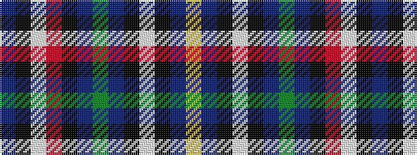

BKWRKBGBKWKBY

It is a 13 stripe tartan.

<figure class="pat-woven">

<figcaption>idealised sample</figcaption>
</figure>

## Colour Sequence



## Tartans with this colour sequence

| Tartans |
|---------------|
| [U.S. Special Forces](/variants/s13/b3k3w1r3k8b2dg36b2k8w1k3b3ly2~x2/)|
||
