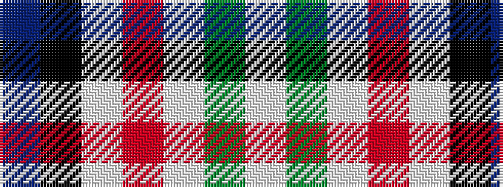

BKWRWGW

It is a 7 stripe tartan.

<figure class="pat-woven">

<figcaption>idealised sample</figcaption>
</figure>

## Colour Sequence



## Tartans with this colour sequence

| Tartans |
|---------------|
| [Ferguson Dress](/setts/s7/t17k12w9m2w9g1w2~x4/)|
||
| [Ferguson Dress #2](/setts/s7/db68k42w32r5w32dg4w6/)|
||
