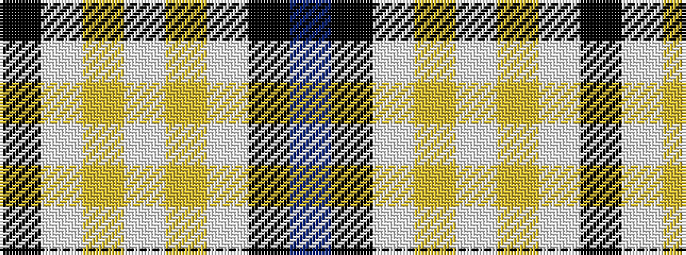

BKWYWYWK

It is a 8 stripe tartan.

<figure class="pat-woven">

<figcaption>idealised sample</figcaption>
</figure>

## Colour Sequence



## Tartans with this colour sequence

| Tartans |
|---------------|
| [Kennison](/setts/s8/k22w16ly2w14ly2w16k22db3~x2/)|
||
