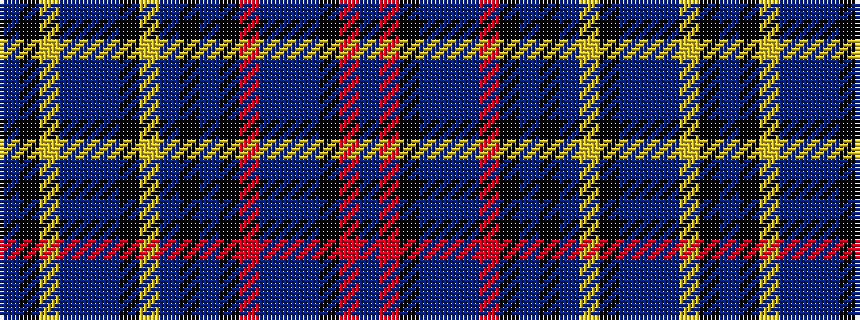

BKYBBBKYBKBKRBBBKRB

It is a 19 stripe tartan.

<figure class="pat-woven">

<figcaption>idealised sample</figcaption>
</figure>

## Colour Sequence



## Tartans with this colour sequence

| Tartans |
|---------------|
| [Unidentified #19](/variants/s19/dbi85r2k2dbi4db4dbi2r2k2dbi20k42b20ly2k2b4t4b4ly2k2b83~x2/)|
||
