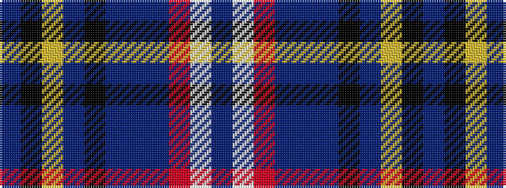

BKYBKBBBRWB

It is a 11 stripe tartan.

<figure class="pat-woven">

<figcaption>idealised sample</figcaption>
</figure>

## Colour Sequence



## Tartans with this colour sequence

| Tartans |
|---------------|
| [Arran Mist](/variants/s11/do8w1o1db10n16do2k3db33lr1ki3do2~x2/)|
||
