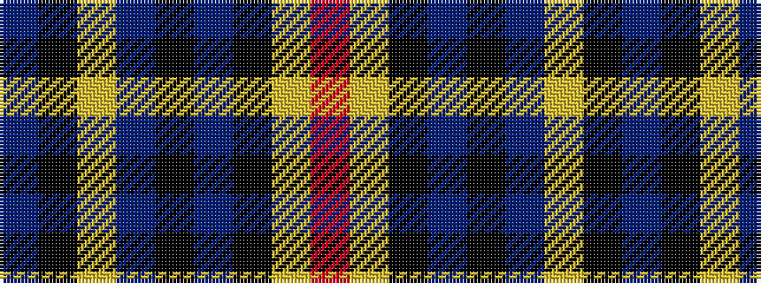

BKYBKBKYR

It is a 9 stripe tartan.

<figure class="pat-woven">

<figcaption>idealised sample</figcaption>
</figure>

## Colour Sequence



## Tartans with this colour sequence

| Tartans |
|---------------|
| [Midnight Glen (Fashion)](/setts/s9/dp3k40lr3dp6k10dp10k3lr1o3~x2/)|
||
