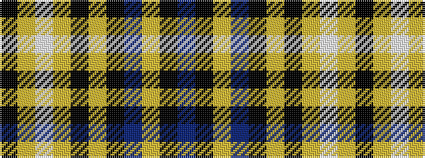

BKYBKYKYWYK

It is a 11 stripe tartan.

<figure class="pat-woven">

<figcaption>idealised sample</figcaption>
</figure>

## Colour Sequence



## Tartans with this colour sequence

| Tartans |
|---------------|
| [Pride of Scotland Royal fashion Tartan Tartan Number: 5586. Earliest known date: See products available Copyright © Blair Urquhart, Comrie, 2015](/setts/s11/k7lr2w2lr2k13lr2k2b1lr13k26b2~x2/)|
||
