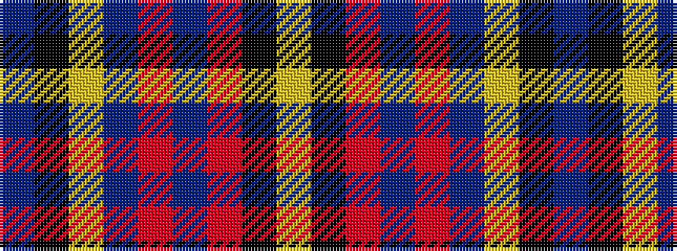

BKYBRBRKY

It is a 9 stripe tartan.

<figure class="pat-woven">

<figcaption>idealised sample</figcaption>
</figure>

## Colour Sequence



## Tartans with this colour sequence

| Tartans |
|---------------|
| [Montgomerie, Colin](/variants/s9/lr2k1r5n3o12n4lr1k40b1~x2/)|
||
