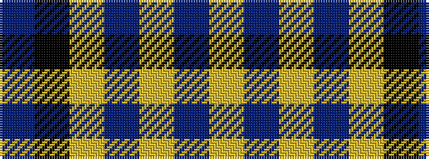

BKYBYBY

It is a 7 stripe tartan.

<figure class="pat-woven">

<figcaption>idealised sample</figcaption>
</figure>

## Colour Sequence



## Tartans with this colour sequence

| Tartans |
|---------------|
| [Wcwm 4907-2](/variants/s7/db40k8ly8db4ly1db4lr8~x4/)|
||
