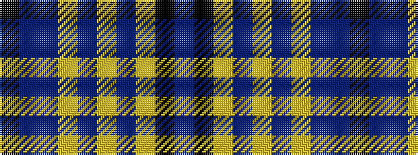

BKYBYBYBBK

It is a 10 stripe tartan.

<figure class="pat-woven">

<figcaption>idealised sample</figcaption>
</figure>

## Colour Sequence



## Tartans with this colour sequence

| Tartans |
|---------------|
| [Ryukoku University Heian Senior High School](/variants/s10/b5k15lr5n9lr2db2lr2db2n9k3~x2/)|
||
